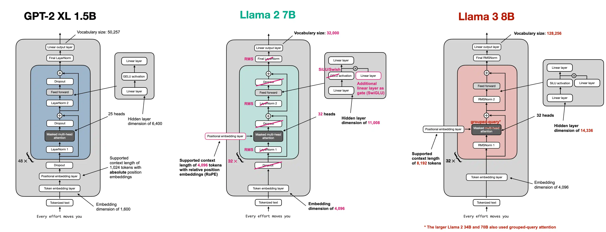
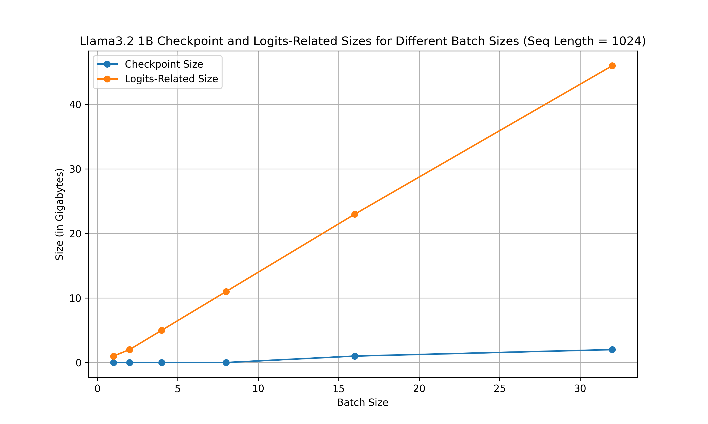
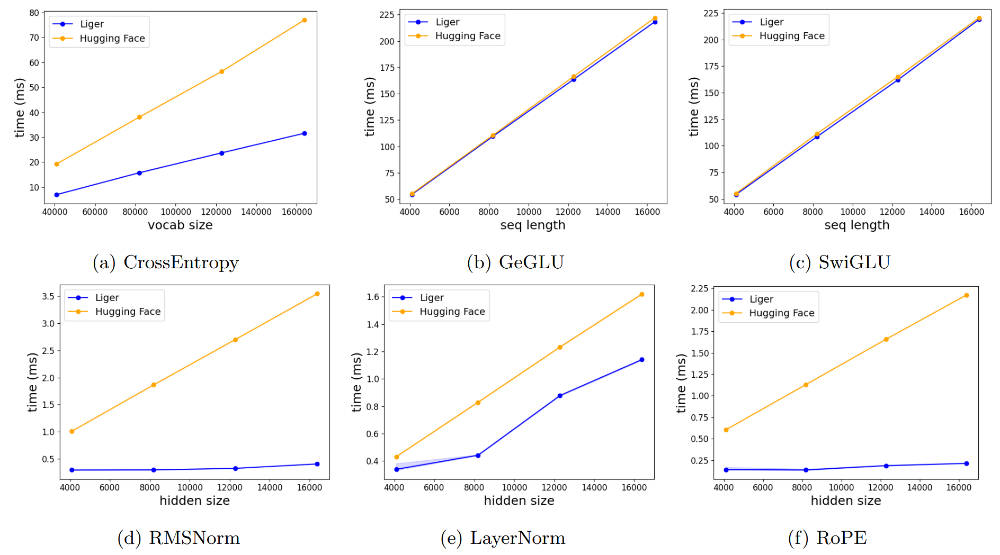
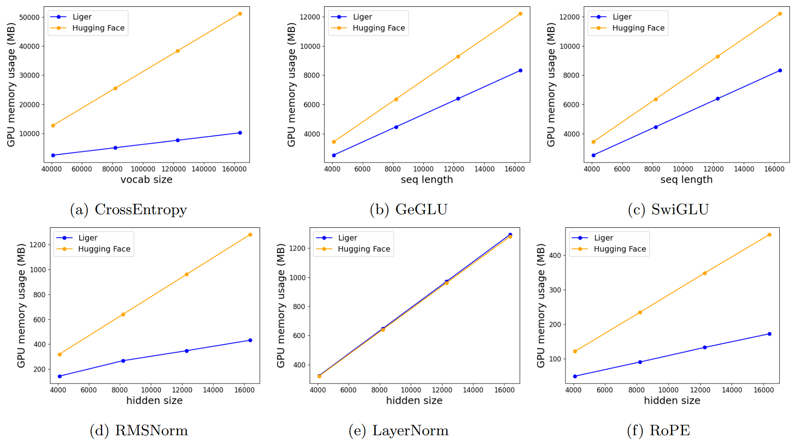

# Memory-Efficient Training of Large Language Models Using Liger Kernel and Other Techniques in 2024

- **Midterm Report** for the course *Artificial Intelligence* (2024 Fall)
- **Submitted on:** 2024/10/23  
- **Author:** Yong-Cheng Liaw (312581029 廖永誠), Master's Student at National Yang Ming Chiao Tung University  
- **Group:** 10


## Title and Authors

- **Title:** Liger Kernel: Efficient Triton Kernels for LLM Training
- **Authors:** Pin-Lun Hsu, Yun Dai, Vignesh Kothapalli (LinkedIn Inc.)
- **Publication:** Technical Report published as a preprint on Arxiv (2024/10/14)
- **Code:** 3.3K Stars, Open-source Project on GitHub (2024/08/07)


# Background and Motivation

## Recent LLM Model Architecture

In recent Large Language Model Architecture, the model architecture has undergone some changes compared to the original transformer architecture. The original transformer architecture is a stack of encoder and decoder, with self-attention and cross-attention [Attention is all you need]. However, after the OpenAI GPT series, the state-of-the-art architecture became a decoder-only model [GPT1,2,3]. Nowadays, the state-of-the-art open-source model, Llama 3.2, also utilizes a dense decoder-only architecture, similar to GPT-2. However, they have some small differences compared to GPT-2.


- **Figure1: From GPT Architecture to Llama3 Architecture [https://github.com/rasbt/LLMs-from-scratch/blob/main/ch05/07_gpt_to_llama/converting-gpt-to-llama2.ipynb].**

The key differences are:
1. Convert absolute positional embedding into RoPE (Rotary Positional Embedding) [https://arxiv.org/abs/2104.09864].
2. Convert Layer Normalization into RMS Norm [RMSnorm].
3. Convert GELU into SwiGLU [SwiGLU].
4. Remove Dropout.
5. Convert multi-head attention into Group Query Attention (GQA) [GQA].

## The GPU VRAM Usage During Training

### Static Memory

When training Large Language Models (LLMs), a significant portion of GPU memory is consumed by static memory usage, which primarily consists of three main components: model weights, gradients, and optimizer states. Understanding these components is crucial for efficient memory management during the training process.

#### Model Weights

Model weights represent the parameters of the neural network and are a fundamental component of any LLM. The memory required for storing model weights is directly proportional to the number of parameters in the model. For instance, a GPT-2 model with 1.5 billion parameters requires approximately 3GB of memory for its weights when using 16-bit precision (2 bytes per parameter).

#### Gradients

Gradients are essential for updating the model weights during the training process. They typically require the same amount of memory as the model weights themselves. For a 1.5 billion parameter model, this would translate to about 3GB of memory for gradients.

#### Optimizer States

Optimizer states often consume the largest portion of static memory during training. The memory requirements for optimizer states like momentum, variance, master weights in popular optimizers like Adam can be significant. For instance, using mixed-precision training with Adam [?] or AdamW [?] can require up to 12 bytes per parameter just for optimizer states. Because it requires storing two additional tensors for each parameter: the momentum and variance of the gradients. When using mixed-precision training with Adam, the memory consumption includes:
1. An fp32 copy of the parameters (4 bytes per parameter)
2. Momentum (4 bytes per parameter)
3. Variance (4 bytes per parameter)

This results in a total of 12 bytes per parameter just for optimizer states.

#### Total Static Memory Usage

For a model with P parameters trained using mixed-precision Adam/AdamW, the total static memory usage can be approximated as:

```
Static Memory = (2P + 2P + 12P) bytes
               = 16P bytes
```

Where:
- 2P bytes for fp16 model weights
- 2P bytes for fp16 gradients
- 12P bytes for optimizer states (fp32 weights copy, momentum, and variance)

For example, a 1.5 billion parameter model would require at least 24GB of static memory during training.

#### Static Memory Optimization Techniques

To reduce static memory usage, several techniques can be employed:

1. **ZeRO**: This technique distributes optimizer states across multiple GPUs, reducing the memory required on each device. The popular implementation of ZeRO [zero paper] is available in DeepSpeed [GitHub] or PyTorch FSDP [FSDP doc or paper].

2. **DeepSpeed Offloading**: DeepSpeed allows offloading optimizer states to CPU memory or even SSD memory, freeing up GPU memory for model weights, gradients, and optimizer states [Zero Offload, Zero Infinity].
    
    - Figure 2: ZeRO Memory Consumption [Zero Infinity paper]

3. **Mixed Precision Training**: Using lower precision (e.g., bfloat16, float16) for weights and gradients can significantly reduce memory consumption and improve training speed if supported by the hardware [NVIDIA Mixed Precision Training blog].

4. **8-bit Optimizers**: This focuses on quantizing optimizer states, such as momentum and variance, into 8-bit by utilizing block-wise quantization to prevent precision degradation [https://arxiv.org/abs/2110.02861].

5. **Gradient Low-Rank Projection (GaLore)**: This approach can reduce optimizer state memory usage by up to 65.5% while maintaining performance by utilizing Low-Rank Projection for optimizer states [https://arxiv.org/abs/2403.03507].

6. **LoRA and QLoRA**: LoRA is a technique that reduces static memory usage by decreasing the number of trainable weights. It projects the same weight matrix using two low-rank matrices, which reduces memory, gradients, and optimizer states. Since the frozen part of the model still requires complete model weights, QLoRA works by further quantizing that part to reduce the memory consumption of model weights [LoRA paper, QLoRA paper].


### Activation Memory

Activation memory refers to the memory used to store intermediate tensors (activations) generated during the forward pass of a neural network. These activations are essential for the backward pass, where gradients are computed for updating model parameters. Activation memory is dynamic and varies with the batch size, model architecture, and sequence length. It tends to dominate GPU memory usage during training because activations need to be stored until they are used in backpropagation.


- **Figure 3: Memory footprint statistics for training massive models [https://arxiv.org/abs/2202.01306].**

#### Gradient Checkpointing (Activation Checkpointing)

Gradient checkpointing is a technique that trades compute for memory by recomputing intermediate activations during the backward pass instead of storing them in memory. This can significantly reduce the memory footprint during training, especially for models with large memory requirements. However, gradient checkpointing can introduce additional computation overhead due to recomputing activations, which may impact training speed.


- **Figure 4: Example of Gradient Checkpointing [https://github.com/cybertronai/gradient-checkpointing].**

### GPU VRAM Bottleneck

So after we have optimized the static memory like using DeepSpeed CPU Offloading to move all static memory from GPU to CPU, enable Gradient Checkpointing to discard all activation. The peak GPU memory usage caused by following two parts:
- The actual **checkpointing value** (which is the stored checkpoint).
- The highest temporary activation usage (occurring between two checkpoints or in sections that aren't checkpointed).
- In the Huggingface Transformers library, a checkpoint is added to the input of each decoder layer. Therefore, the checkpointing value only needs to store the following:
    - `batch * seq * hidden_size * dtype_size * num_layers` For example, using **LLaMA 3.2B** with `batch = 4`, `seq = 1024`, `hidden_size = 2048`, `dtype_size = 2` (fp16), and `num_layers = 16`, the checkpointing value is calculated as:
    - `4 * 1024 * 2048 * 2 * 16 = 268,435,456 bytes = 256MB`
- For the **temporary activation memory**, the largest factor comes from **cross-entropy-related activations**, which include logits, shifted logits, and intermediate values during the cross-entropy calculation.

    
    - **Figure 5: Llama3.2 Logits related Implementation of HuggingFace Transformers Library.**

- This is significant because the `vocab_size` is often much larger than the `hidden_size`. For example, in LLaMA 3.2 1B, `vocab_size = 128,256`, while `hidden_size = 2048`.
- Thus, a single logits value can occupy:
    - `4 * 1024 * 128,256 * 4 (cast to float for loss calculation) = 2,101,346,304 bytes ≈ 2GB`
- Moreover, there are multiple instances of these logits-related values. In our experiments, we observed that there are three logits-related values active simultaneously (logits, shift_logits, cross-entropy temp value). This results in: `2GB * 3 = 6GB` VRAM usage.
    
    
    
    - **Figure 6: VRAM Snapshot for training Llama3.2 1B while enable gradient checkpoint + zero infinity cpu offloading with batch=4, seq=1024.**

- The factor affecting logits memory usage is primarily `batch_size` and `seq_size`. Therefore, increasing the batch size or sequence length leads to a rapid increase in peak memory usage.
    
    
    - **Figure 7: Comparison of Estimated Scaling Memory Usage between Checkpoint and Logits-Related Size.**

- This peak memory usage limits the batch size that can be increased, even if there is space available to use.

## Kernel Operation Level Optimization

In current PyTorch, we can easily develop models by executing calculations in the eager execution model. However, this is not the best way to fully utilize GPU power because there are many computational overheads, including function call stack, dispatching, and CUDA kernel launch latencies [https://pytorch.org/blog/accelerating-pytorch-with-cuda-graphs/, https://pytorch.org/blog/optimizing-production-pytorch-performance-with-graph-transformations/, https://developer.nvidia.com/blog/understanding-the-visualization-of-overhead-and-latency-in-nsight-systems/].

### Dispatching Overhead

PyTorch uses a dynamic dispatching mechanism to determine which implementation of an operation to use based on input types and devices. This process introduces overhead in several ways:
1. **Type checking:** The system must check the types of input tensors for each operation.
2. **Device selection:** The appropriate implementation (CPU, CUDA, etc.) must be selected for each operation.
3. **Operator lookup:** The correct operator implementation must be found and called for each operation.

### CUDA Kernel Launch Latencies

When using GPUs, eager mode can lead to significant overhead due to CUDA kernel launch latencies:
1. **Frequent kernel launches:** Each operation typically results in a separate CUDA kernel launch.
2. **Launch overhead:** There's a fixed overhead associated with each kernel launch, which can be significant for small operations.

### Memory Transfer Overhead

Eager mode can result in suboptimal memory usage patterns:
1. **Frequent host-to-device transfers:** Input data may need to be transferred from CPU to GPU memory more frequently than necessary.
2. **Intermediate results:** Each operation may write its results back to memory, increasing memory bandwidth usage.

### Kernel Fusion

Due to the above overheads, kernel fusion is a technique that combines multiple operations into a single kernel to reduce overhead and improve performance. By fusing operations together and optimizing the kernel implementation, we can reduce the number of kernel launches, memory transfers, and dispatching overheads.  
A popular approach to perform kernel fusion is writing GPU kernel operations in Triton [https://openai.com/index/triton/].

Triton is a language and compiler for parallel programming. It aims to provide a Python-based programming environment for productively writing custom DNN compute kernels capable of running at maximal throughput on modern GPU hardware.

```python
BLOCK = 512
@jit
def add(X, Y, Z, N):
   # In Triton, each kernel instance
   # executes block operations on a
   # single thread: there is no construct
   # analogous to threadIdx
   pid = program_id(0)
   # block of indices
   idx = pid * BLOCK + arange(BLOCK)
   mask = idx < N
   # Triton uses pointer arithmetic  
   # rather than indexing operators
   x = load(X + idx, mask=mask)
   y = load(Y + idx, mask=mask)
   store(Z + idx, x + y, mask=mask)
```

The Liger Kernel uses Triton to implement fused operations at the kernel level. The reasons for using Triton are as follows:
1. **Easier programming:** Compared to writing the kernel in C++ CUDA, Triton allows writing kernels in Python, making development and debugging easier.
2. **Kernel Level Optimization:** Compared to the eager execution model, Triton can optimize at the kernel operation level, enabling more detailed optimizations.
3. **Python-native:** There's no need to maintain different types of code files, like C++ and Python.
4. **Clean dependency:** Triton is a standalone library that can be easily integrated into existing codebases.
5. **Real Production Ready Usecase:** There are already several successful kernel operation-level projects done using Triton, such as FlashAttention and Unsloth [flashattention, unsloth].

        
# Method

## Fused Linear Cross Entropy

In the previous section, we discussed the memory bottleneck caused by cross-entropy-related activations during training. The Fused Linear Cross Entropy aims to solve this problem through a two-way approach:
1. **Split the cross-entropy calculation into chunks to reduce peak memory usage.**

    The reason we can separate the cross-entropy calculation into chunks is that to calculate the **cross-entropy loss** in a Causal Language Model (LM) for an input with shape `[batch_size, seq_length]`, it is compare the predicted token probabilities with the ground truth token indices for the next token at each position in the sequence, but the final loss is the average of the losses at each position. Therefore, the cross-entropy loss can be calculated independently for each position in the sequence. The formula for the cross-entropy loss is:
    \[
    \mathcal{L}_{\text{cross-entropy}} = -\frac{1}{N}\frac{1}{T-1} \sum_{i=1}^{N} \sum_{t=1}^{T-1} \log p(y_t | x_{1:t}) 
    \]
    Where:
    - \(N\) is the batch size
    - \(T\) is the sequence length
    - \(y_t\) is the ground truth token at time step \(t+1\)
    - \(p(y_t | x_{1:t})\) is the predicted probability of token \(y_t\) given the tokens \(x_{1:t}\)

2. **Calculate the backward gradient when calculating the forward pass, utilizing in-place calculation to reduce memory usage.**

    The reason we can calculate the backward gradient during the forward pass is that the cross-entropy loss is the last operation in the forward pass, so it doesn't rely on other back-propagated gradients. Additionally, because the cross-entropy loss can be calculated independently for each position in the sequence, the gradients can also be calculated independently for each position. Therefore, we can calculate the gradients in-place during the forward pass, reducing memory usage by not storing the intermediate activations.


- **Figure 8: Fused Linear Cross Entropy**

The advantages of the Fused Linear Cross Entropy are that by chunking the cross-entropy calculation, the peak memory usage is not calculated by `batch_size * seq_size * vocab_size`, but by `chunk_size * vocab_size`, which can limit the peak memory usage, even if the batch size or sequence length is increased. By calculating the backward gradient during the forward pass, it can further reduce memory usage by not storing intermediate activations. Last but not least, the fused operation can reduce overhead by reducing the number of kernel launches, memory transfers, and dispatching overheads.

However, there are some disadvantages to the Fused Linear Cross Entropy. If the chunk size is too small, the calculation will be done chunk by chunk, which will decrease GPU utilization. Therefore, setting the correct chunk size is crucial for the performance of the Fused Linear Cross Entropy. In their current work, they try to set the chunk size so that the temporary activation memory is the same as the hidden_size activation, which can keep peak memory usage stable. The chunk size is calculated by \[2^{\lceil \log_2 \lceil \frac{BT}{\lceil \frac{V}{H} \rceil} \rceil \rceil}\]. This formula can be explained as follows: since hidden activation is \(BT * H\), and chunk activation is \(chunk\_size * V\), so \(chunk_size\) = \( \frac{BT}{V / H} \). And because the chunk size should be a power of 2, the ceiling function is applied, followed by calculating the log2 and raising 2 to that power.


## Other Fused Kernels

Following the same principle as the Fused Linear Cross Entropy, the Liger Kernel also provides other fused kernels to optimize the training process. These fused kernels include:
1. **RMSNorm (Root Mean Square Normalization) [Biao Zhang and Rico Sennrich. Root mean square layer normalization. Advances in Neural Information Processing Systems, 32, 2019.]**
2. **RoPE (Rotary Positional Embedding) [Roformer. Enhanced transformer with rotary position embedding]**
3. **SwiGLU [Glu variants improve transformer]**
4. **GeGLU [Glu variants improve transformer]**
5. **Layer Normalization [Jimmy Lei Ba, Jamie Ryan Kiros, and Geoffrey E Hinton. Layer normalization]**

These fused kernels aim to fuse small operations together rather than executing them one by one. For example, in the case of RMSNorm, the formula is \[x_{\text{norm}} = \frac{x}{\text{RMS}}, \text{RMS} = \sqrt{\frac{1}{N} \sum_{i=1}^{N} x_i^2}\]. The calculation includes both the normalization and scaling parts, which can be fused together. Additionally, because it is a fused operation, some calculations can be done in place to reduce memory usage, and values like the RMS can be cached to reduce computation overhead.

# Experimental Results

The Liger Kernel runs all benchmarks on a single NVIDIA A100 GPU (80 GB). The CrossEntropy kernel is benchmarked on vocab sizes in the set {40960, 81920, 122880, 163840}. The GeGLU and SwiGLU kernels are benchmarked on varying sequence lengths, whereas the RMSNorm, LayerNorm, and RoPE kernels are benchmarked on varying hidden dimensions. The sequence lengths and hidden dimension sizes are chosen from {4096, 8192, 12288, 16384}. All benchmarks are repeated 10 times to plot the median speed and memory along with [0.2, 0.8] quantile values as the lower and upper bounds.

1. **Speed Benchmark:**

    
    - **Figure 9: Kernel execution speed benchmarks**

2. **Peak Memory:**

    
    - **Figure 10: Kernel peak allocated memory benchmarks.**

3. **Llama3 8B Training with Fixed seq_length 512:**

    
    - **Figure 11: Comparison of peak allocated memory and throughput for LLaMA 3-8B.**

The result is promising, showing that the Liger Kernel can significantly reduce memory usage and improve training speed compared to the baseline. In the real training process, the Liger Kernel only slightly increases the peak memory usage when scaling up the batch size, whereas the original Hugging Face implementation increases the peak memory usage linearly. This allows researchers or anyone who wants to train a large language model to scale up the batch size without worrying about peak memory usage. The Liger Kernel can also improve the overall throughput of the training process, which can reduce the training time and cost.


# DEMO

To reproduce the results better, and profile the actual memory usage reduction and throughput improvement by the Liger Kernel, i design the following experiments to demonstrate the Liger Kernel's impact on training LLMs. All Demo code is available on the following Github Repository[112-2-Artificial-Intelligence-Midterm](https://github.com/DandinPower/112-2-Artificial-Intelligence-Midterm).

- **Experiments Environment:**
    - Opearting System: Ubuntu 24.04 Desktop
    - CPU: i9-13900K
    - DRAM: 128GB
    - GPU: NVIDIA 4090 24GB

- **Experiments Setup:**
    - Batch Size: 1, 4, 8, 16, 32, 64, 96, 112
    - Sequence Length: 1024
    - Model: Llama3.2 1B (Huggingface Transformers)
    - Full Parameter Training: No LoRA
    - Enable mixed precision training (fp16)
    - Enable Gradient Checkpointing
    - Enable DeepSpeed CPU Weights and Optimizer States Offloading


This setup is the move all static memory from GPU to CPU and discard all activation memory, so the peak memory usage is mainly caused by the checkpointing value, temporary activations and the gradients for the optimizer step.

1. **Memory Usage Profiling:**

    - Figure 12: Memory Snapshot Profiling at Batch ? with (a) Liger Kernel (b) Huggingface Transformers

2. **Comparison of Peak Memory Usage:**

3. **Comparison of Throughput:**

## Ablation Study on Fused Linear Cross Entropy

The reason to do this ablation study is that the Fused Linear Cross Entropy solve the most memory bottleneck, so knowing how many improvements it can bring is crucial.

- **Experiments Strategies:**
    - Enable All Liger Kernel (Fused Linear Cross Entropy, RMSNorm, RoPE, SwiGLU)
    - Enable All Liger Kernel without Fused Linear Cross Entropy (RMSNorm, RoPE, SwiGLU)
    - Disable All Liger Kernel

1. **Comparison of Peak Memory Usage:**

2. **Comparison of Throughput:**


# Conclusion and Personal Reflection

- **The main problem of the current LLM training**
    
    Cross Entropy Peak Memory Let the batch size and sequence length be limited.

- **The main contribution of the Liger kernel**

    1. fused kernel
    2. chunking 

- **How to train the large language model efficiently in 2024**

    There are many memory efficient training techniques for training large langauge models nowadays, thanks to the Huggingface Transformers library developers and the open-source community. The above technique (also include liger kernel) all integrated into the Huggingface Transformers library, so it is easy to use and deploy. The following is my recommended way to train a large language model in full parameter training (don't consider LoRA) memory efficiently in 2024:

    - *The must enable no matter what:*
        1. enable liger kernel
        2. (if multiple GPUs) enable stage2 zero
        3. enable gradient checkpointing (slightly increase computation overhead)

    - *If Still have Out of Memory Issue:*

        4. enable mixed precision training (slightly degrade the precision)
        5. (if multiple GPUs) enable stage3 zero (with additional communication footprint)
        6. enable deepspeed cpu offloading (increase PCIE transfer overhead)
        7. enable 8bit optimizer or GaLore (degrade the precision)
        8. enable deepspeed nvme offloading (increase a lot PCIE transfer overhead)

# Reference

1. Liger kernel paper
1. liger kernel talk: https://www.youtube.com/watch?v=gWble4FreV4
1. pytorch profiler and tensorboard plugin
2. deepspeed zero, fsdp
3. deepspeed offloading
4. gradient checkpointing
5. lora
6. Qlora
6. 8bit optimizer
7. triton
9. flashattention
10. unsloth.ai 
11. nvidia mixed precision training